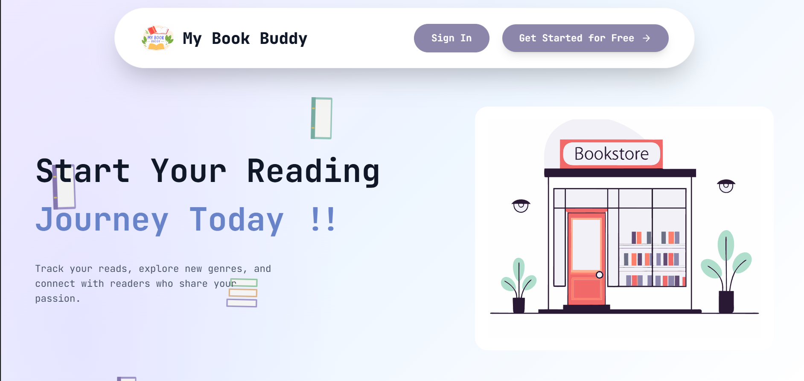
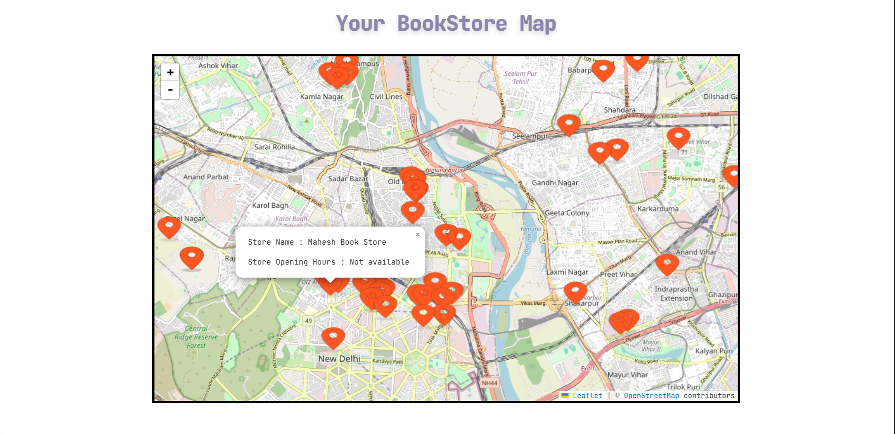
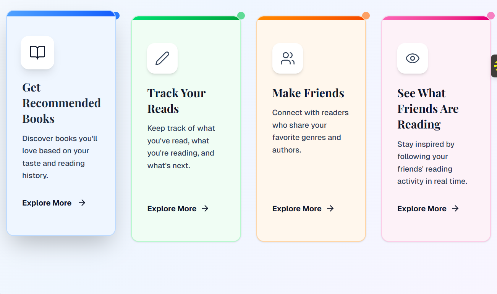

My Book Buddy
==============

Modern web app to track your reading, discover new books and events, and connect with friends. Monorepo with a React + Vite client and an Express + Prisma + PostgreSQL API.

Features
- Core experience: A personal hub for readers. Browse trending books, run fast searches, save favorites, and keep a tidy reading history. The home page presents a welcoming hero and a subtle decorative background so content stays readable while the UI feels lively.
- Book discovery: Search across titles/authors with responsive UI and request cancellation via `AbortController` to avoid stale results. Empty queries gracefully show a popular feed so users always have something to explore.
- Events near you: Find book‑related events and nearby bookstores through the dedicated pages. The UI provides filters and clean list/detail views to help you decide where to go next.
- Friends & social layer: View profiles of your friends, see what they’re reading, and browse connections through the friends pages. The API exposes routes for friends, profiles, and reading history, enabling a lightweight social experience without heavy complexity.
- Profile & history: A focused profile area shows your details and reading history (persisted via the API). It’s designed for quick scanning, with room to expand into shelves, notes, and ratings.
- Authentication & security: Login/Sign‑in flows issue short‑lived JWT access tokens and a long‑lived HTTP‑only refresh cookie. Axios interceptors transparently refresh tokens on 401 and retry the original request once, keeping session management smooth and safe.
- Protected routes: Sensitive client pages use an Auth context and a `ProtectedRoute` component to guard access. The `axiosPrivate` instance attaches the `Authorization: Bearer <token>` header automatically.
- Polished UI/UX: Responsive layout with a stable hero section, themed “We Offer” cards, and a full‑page gradient background with floating book SVGs. Animations are gentle and layered behind content to preserve readability.
- API & data: Express routes cover auth, books, events, friends, and profile/history. Prisma manages the PostgreSQL schema and migrations (including refresh‑token relationships), making data operations reliable and maintainable.
- Performance & DX: Vite dev server for instant feedback, request cancellation for search, clean component structure, and a clear monorepo layout for client/server collaboration.

Tech Stack
- Client: React, Vite, React Router, Axios, Tailwind CSS
- Server: Node.js, Express, Prisma ORM, PostgreSQL, cookie‑parser, CORS

Repository Layout
```
My-Book-Buddy/
  client/           # React app (components, pages, assets, styles)
  server/           # Express API (controllers, routes, middlewares, prisma)
  README.md
```

Prerequisites
- Node.js 18+
- PostgreSQL 13+ running locally (or a connection URL)

Environment (server/.env)
Create `server/.env` with:
```
DATABASE_URL=your_database_url
SHADOW_DATABASE_URL=your_shadowdatabse_url
JWT_ACCESS_SECRET=replace_with_strong_secret
JWT_REFRESH_SECRET=replace_with_strong_secret
CORS_ORIGIN=your_cors_origin
PORT=your_port_no
```

Google APIs (server)
Add these to `server/.env` for book search and metadata enrichment:
```
# Required: used by server/controllers/books.js to fetch volumes
GOOGLE_BOOKS_API_KEY=your_google_books_api_key


How to obtain keys
- Go to Google Cloud Console → APIs & Services
- Enable “Books API” 
- Create an API key and paste it into `server/.env`

Notes
- Keep these server‑side; do not expose them to the client.
- Never commit real keys—use `.env` locally and CI secrets in deployment.

Install & Run (two terminals)
```powershell

cd server
npm install
npx prisma migrate dev ; npx prisma generate
npm start

cd ../client
npm install
npm run dev
```

Local URLs
- Client: http://localhost:5173
- API:    http://localhost:3000

Screenshots



.png)

Descriptions
- Home: Hero section with full‑page gradient and floating book SVGs, quick entry points to search and features, and responsive layout that stays stable across breakpoints.
- Map: Interactive map view to explore nearby bookstores/events with markers and informative popups; designed for clarity and easy scanning on desktop and mobile.
- What We Offer: Themed feature cards showcasing core app capabilities with subtle hover states and accessible contrast for readable content.
- Login: Clean sign‑in flow with client/server validation, helpful error messages, and redirect into protected areas on success.

Auth Flow (summary)
- Server sets an HTTP‑only refresh cookie on login
- Client stores access token in memory; `axiosPrivate` adds `Authorization: Bearer <token>`
- Axios interceptor refreshes on 401 and retries once
- Protected components defer fetching until token is ready

Key Client Paths
- `client/src/context/AuthContext.jsx` – token lifecycle, interceptors
- `client/src/api/axios.js` – `axiosPublic`/`axiosPrivate` instances
- `client/src/components/ProtectedRoute.jsx` – route guard
- `client/src/pages/Home.jsx` – gradient + floating SVG background
- `client/src/components/Hero.jsx` / `WeOffer.jsx` – hero and offer cards
- `client/src/App.css` – background and float keyframes

Key Server Paths
- `server/server.js` – app bootstrap, CORS, routes
- `server/controllers/` – auth, profile, books, events, friends, history
- `server/middlewares/AuthMiddleware.js` – bearer verification
- `server/prisma/schema.prisma` – DB models & relations

Production Notes
- Set cookies `Secure:true` (HTTPS) and tune `SameSite` per deployment
- Set `CORS_ORIGIN` to your client domain
- Run `npx prisma migrate deploy` during release pipelines


License
This project is for learning/demo purposes. Add a license if you plan to distribute.
